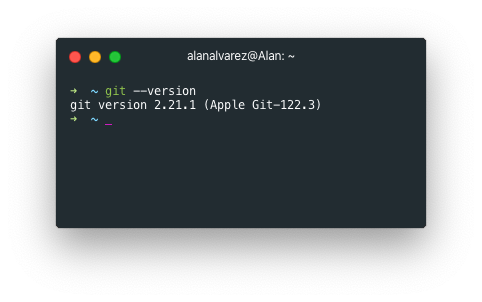
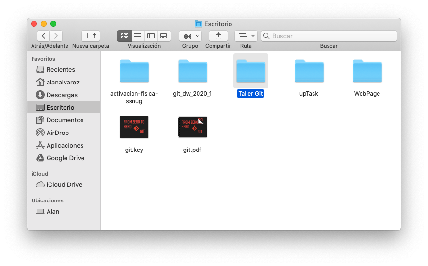

# Git: From Zero to Hero

Bienvenido a este taller de la *DevWeek Ene-Jun 2020*, por parte de *BeeDevelopers*, en donde te enseñarémos como usar el sistema de control de versiones mas popular hoy en día: *Git*. De igual manera, te mostraemos *GitHub* y los repositorios remotos.


---

## Descargas, instlación y confirguación

### Descargar Git

Antes de descargar git, deberás comprobar si tu computadora no posee ya alguna versión de git. Es posible que sistemas operativos como **Linux** o **MacOS** tengan pre-instalado git.

Para comprobar si posees alguna versión de git ejecuta el siguiente comando en la terminal de tu sistema opertaivo.

```bash
git --version
```

Deberás obtener una respuesta como esta:



Si no tienes git instalado da click [aquí](https://git-scm.com/downloads) y descarga la versión correcta para su sistema operativo. Será de gran ayuda tener un editor de texto como **Visual Studio Code** o el que sea de tu preferencia, para descargarlo da click [aquí](https://code.visualstudio.com).

Una vez terminado el proceso de instalación necesitas ejecutar el comando antes mencionado para comprobar que se ha instalado correctamente.

### Confirguración básica

Debemos confirgurar nuestro nombre de ususuario y correo electrónico para comenzar a usar git. 

Ejecuta el siguiente comando para confirgurar tu nombre:

```bash
git config --global user.name "Tu nombre"
```

Enseguida, ejecuta el siguiente comando para configurar tu email:

```bash
git config --global user.email correo@ejemplo.com
```

Para comprobar que los cambios se hayan efectuado, ejecutamos el siguiente comando:

```bash
git config --list
```

### Crea tu cuenta en Github

Todavía no es momento de empezar a trabajar con **GitHub**. Sin embargo, para agilizar este taller te recomendamos acceder a este [url](https://github.com) y comenzar a crear tu cuenta en **GitHub**, es gratis y procura usar el mismo email que empleaste en la configuración básica de *git*.

---

## Tu primer repositorio

Ve al escritorio de tu sistema operativo y crea una nueva carpeta, nombrala *Taller Git*. 



Deberás acceder al interior de tu carpeta desde la terminal o ventana de comandos. Si no estas seguro de cómo hacerlo, no te preocupes nosotros te apoyaremos. 

Una vez dentro de tu carpeta *Taller Git*, desde la línea de comando o terminal, ejecuta el siguiente comando:

```bash
git init
```

¿Qué hace *git init*? Este comando se emplea para indicar que el directorio donde nos encontramos comenzará a trabajar como un repositorio. Crea, dentro del mismo, un subdirectorio llamado *.git* que contiene todo lo necesario para que git comience a trabajar. También creará la rama **master** de nuestro proyecto.